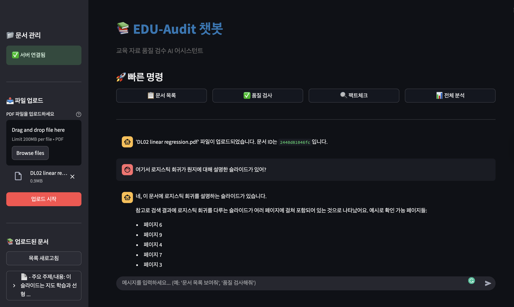
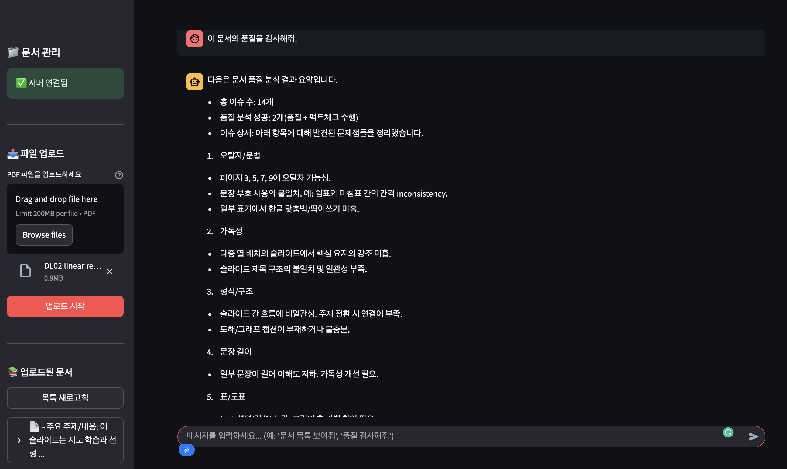
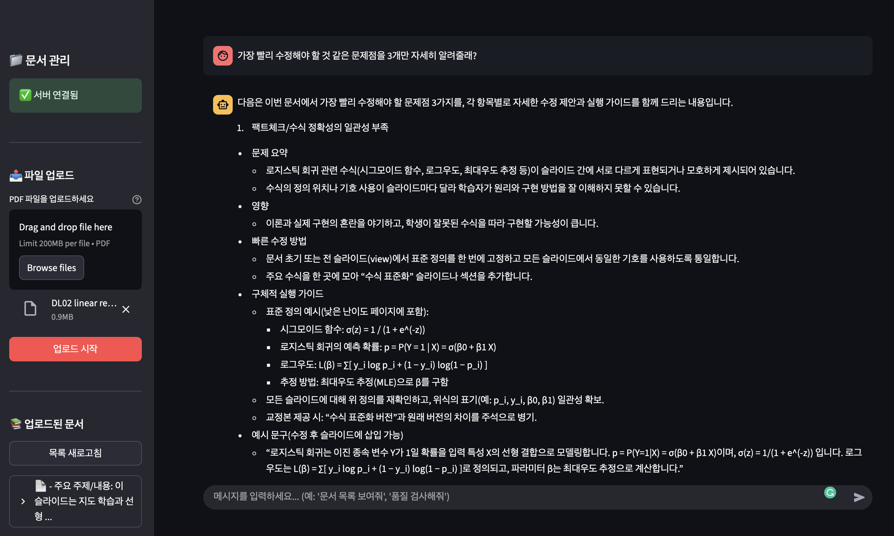
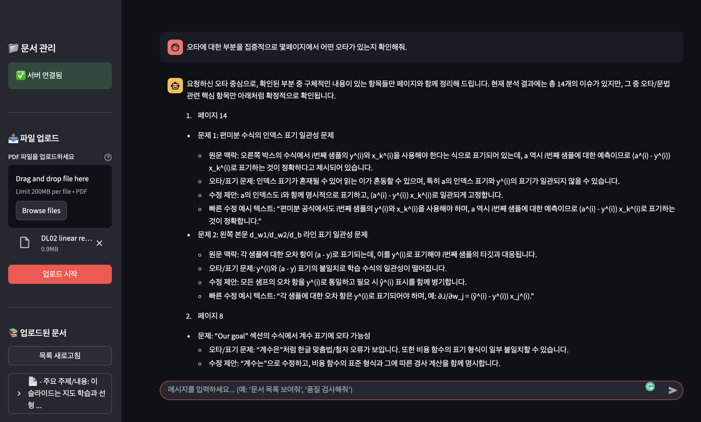

# 📘 EDU-Audit 챗봇  
교육 자료 품질 검수 AI 어시스턴트

---

## 📑 프로젝트 소개
EDU-Audit 챗봇은 **강의 슬라이드, 과제 자료, 연구 문서 등 교육 자료의 품질을 자동 검수**하는 AI 어시스턴트입니다.  
오탈자, 문장 가독성, 수식·표기 오류, 최신 정보 여부 등을 분석해 교육자가 자료 품질을 개선할 수 있도록 돕습니다.  

---

## ✨ 주요 기능
- **문서 업로드** : PDF 업로드 지원 (최대 200MB)  
- **품질 검수** : 오탈자, 문법, 가독성, 수식·표기 오류 탐지  
- **팩트체크** : 최신 정보와 대조해 outdated 여부 확인
- **전체 분석** : 문서 전체 요약 및 개선 포인트 리포트 제공
- **빠른 질의응답** : “이 문서에서 로지스틱 회귀 설명이 있나요?” 와 같은 질의 가능

---

## ⚙️ 아키텍처
- **Frontend** : Streamlit
- **Backend** : FastAPI
- **LLM Integration** : OpenAI API / Llama Index / LangChain  
- **Pipeline** : 문서 파싱 → 품질 분석 → RAG 기반 팩트체크 → 리포트 생성

---

## 🚀 설치 및 실행 방법
```bash
git clone https://github.com/matmang/edu-audit-chatbot.git
cd edu-audit-chatbot
pip install -r requirements.txt
# 문서 품질 분석 API 서버 실행
python -m src.app.main
# 챗봇 실행
streamlit run src/app/chatbot/app.py
```

**프로젝트 디렉토리에 환경변수 파일 `.env.dev` 추가**
```bash
OPENAI_API_KEY=#사용할 openai api key 입력
SERPAPI_API_KEY=#팩트체크 검색을 위한 surpapi 키 입력
DEBUG=true
LLM_MODEL=#추론에 사용할 openai llm 모델 명 입력 - 기본: gpt-5-nano
VISION_MODEL=#슬라이드 이미지 분석에 사용할 openai vlm 모델 명 입력 - 기본: gpt-5-nano
EMBEDDING_MODEL=#임베딩에 사용할 openai 임베딩 모델 명 입력 - 기본: text-embedding-3-small
```

⸻

## 📌 향후 추가 기능
- PowerPoint 원본 파일 파싱 기능
- 용어/수식의 일관성 검사 기능
- 원본 슬라이드 기반 상세 분석 기능
- RAG 기반 심화 질의응답

---

## 🖼️ 사용 예시

### 1. 문서 업로드 & 검색


### 2. 품질 검수 결과


### 3. 개선 우선순위 제안


### 4. 오타 검출 결과
